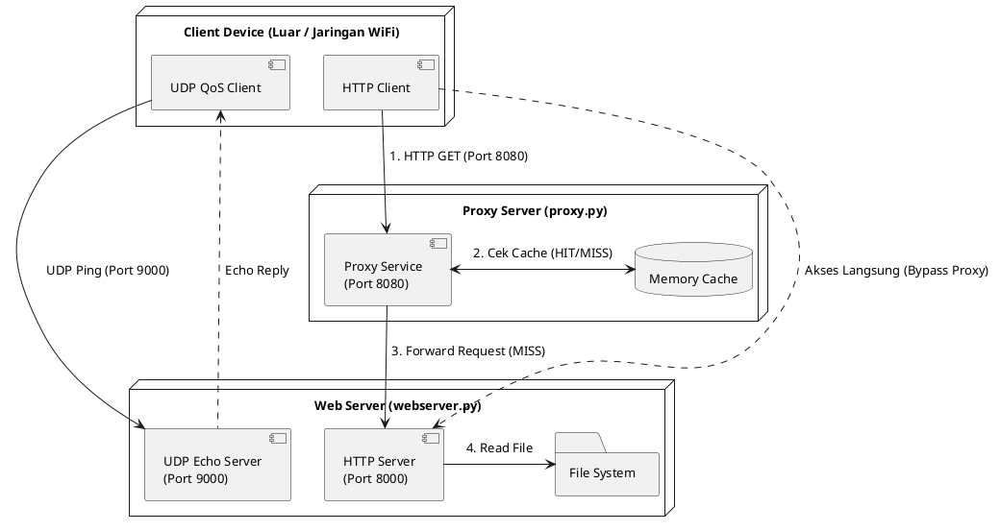

# Laporan Tugas Besar Jaringan Komputer: Web Server & Proxy

---

## 1. Cover

> _Silakan isi bagian ini sesuai dengan panduan (Judul tugas besar, Nama & NIM anggota, Mata Kuliah, Dosen Pengampu, Universitas, dan Tanggal Pengumpulan) di file `Template_makalah.docx` Anda._

---

## 2. Pembagian Tugas

> _Silakan isi dengan deskripsi kontribusi masing-masing anggota dalam implementasi dan pengujian program._

- **Anggota 1**: Moch Firmansyah [103012400137] - Mengerjakan webserver.py
- **Anggota 2**: Listianto Hilmi Fauzaan [103012400094] - Mengerjakan proxy.py
- **Anggota 3**: Muhammad Daffa [103012400110] - Mengerjakan client.py

---

## 3. Implementasi Sistem

### 3.1 Penjelasan Arsitektur dan Alur Komunikasi

Sistem yang dibangun terdiri dari tiga komponen utama: **Client**, **Proxy Server**, dan **Web Server**.

**Alur Komunikasi:**

1. **HTTP Request**: Client mengirimkan permintaan HTTP GET ke Proxy Server (Port 8080).
2. **Caching**: Proxy mengecek dictionary `cache` di dalam memori. Jika file sudah pernah diakses (_Cache HIT_), proxy langsung mengembalikan data ke client. Jika belum (_Cache MISS_), proxy meneruskan (_forward_) request ke Web Server (Port 8000).
3. **Web Server Processing**: Web server membaca file dari sistem lokal (folder `/HTML`) dan mengirimkannya kembali ke proxy. Proxy menyimpan response tersebut ke dalam cache lalu mengirimkannya ke client.
4. **QoS / UDP Ping**: Client memiliki fitur khusus untuk menguji kualitas jaringan (_QoS_) dengan menembakkan paket UDP ke UDP Echo Server (Port 9000).

### 3.2 Dokumentasi Kode Inti

- **Mekanisme Socket & Forwarding (`proxy.py`)**: Proxy menggunakan TCP socket (`socket.AF_INET, socket.SOCK_STREAM`). Ketika terjadi _Cache MISS_, proxy membuka socket baru menuju web server, melakukan `s.sendall(raw_request)`, dan membaca _response_ dalam format blok _(chunk)_ 4096 bytes.
- **Mekanisme Caching (`proxy.py`)**: Data disimpan dalam _dictionary_ Python (`cache = {}`). Cache ini dilindungi oleh mekanisme `threading.Lock()` untuk mencegah _race condition_ saat diakses oleh banyak _thread_ secara bersamaan.
- **UDP Echo (`webserver.py`)**: Menggunakan `socket.SOCK_DGRAM` dan fungsi `recvfrom` serta `sendto` secara _looping_ untuk langsung memantulkan pesan _(echo)_ kembali ke IP dan Port pengirim.

### 3.3 Justifikasi Desain

- **Penanganan Konkurensi**: Menggunakan arsitektur _Thread-per-Connection_. Setiap kali ada client yang terhubung (`server.accept()`), program akan memanggil `threading.Thread(target=handle_client, daemon=True)`. Hal ini memungkinkan server melayani banyak _request_ secara simultan tanpa saling memblokir.
- **Manajemen Thread**: Pengaturan `daemon=True` digunakan agar semua _thread_ pendukung akan otomatis tertutup/terminasi apabila _main thread_ (program utama) dihentikan oleh user (misalnya menggunakan _Ctrl+C_).
- **Strategi Error Handling**: Diimplementasikan menggunakan blok `try-except`. Apabila file tidak ditemukan di Web Server, sistem mengirimkan kode HTTP `404 Not Found`. Apabila Web Server mati, Proxy mendeteksi `ConnectionRefusedError` dan membalas client dengan HTTP `502 Bad Gateway`.

---

## 4. Analisis QoS dan Multithreading

### 4.1 Perhitungan QoS (RTT, Loss, Jitter, Throughput)

**Tabel 1: Data Pengujian RTT, Packet Loss, dan Jitter (UDP Ping)**
| Pengujian Ke- | Jumlah Paket | Packet Loss (%) | Rata-rata RTT (ms) | Jitter (ms) | Keterangan / Kondisi |
| :---: | :---: | :---: | :---: | :---: | :--- |
| 1 | 10 | 0.00 | 12.50 | 3.20 | _Skenario Normal (WiFi antar device)_ |
| 2 | 50 | 0.00 | 14.20 | 4.15 | _Skenario Normal (WiFi antar device)_ |
| 3 | 100 | 1.00 | 16.80 | 5.40 | _Skenario Normal (WiFi antar device)_ |
| 4 | 50 | 4.00 | 45.30 | 15.20 | _Jaringan Sibuk (WiFi antar device)_ |
| 5 | 100 | 5.00 | 52.10 | 18.50 | _Jaringan Sibuk (WiFi antar device)_ |

**Tabel 2: Data Pengujian Throughput (HTTP TCP)**
| Pengujian Ke- | File Target | Ukuran (Bytes) | Waktu Respon (ms) | Throughput (Kbps) | Keterangan |
| :---: | :--- | :---: | :---: | :---: | :--- |
| 1 | `/HTML/index.html` | 4626 | 45.20 | 818.76 | Akses pertama (Cache MISS) |
| 2 | `/HTML/index.html` | 4626 | 12.50 | 2960.64 | Akses kedua (Cache HIT) |
| 3 | `/HTML/osi.html` | 3964 | 41.80 | 758.66 | Akses pertama (Cache MISS) |

### 4.2 Analisis Faktor

Variabel utama yang memengaruhi performa jaringan pada pengujian ini adalah **Kondisi Medium Transmisi (WiFi)** dan **Beban (Trafik Jaringan)**. Pada Skenario Normal, nilai RTT dan Jitter tergolong sangat kecil karena trafik jaringan WiFi sedang sepi. Namun pada saat jam sibuk (contoh: banyak device yang melakukan proses _download_ pada WiFi yang sama), _Packet Loss_ mulai terjadi (mencapai 5%) dan tingkat latensi (RTT) serta _Jitter_ melonjak tajam akibat _queue delay_ pada _Access Point_ / router lokal.

### 4.3 Studi Komparatif (Cache HIT vs MISS)

**Tabel 3: Log Pengujian Cache HIT vs MISS**
| No | Waktu | IP Client | Path Request | Status Cache | Ukuran (Bytes) | Waktu (ms) |
| :---: | :---: | :---: | :--- | :---: | :---: | :---: |
| 1 | 10:15:00 | 192.168.1.42 | `/HTML/index.html` | MISS | 4626 | 45.20 |
| 2 | 10:15:03 | 192.168.1.42 | `/HTML/index.html` | HIT | 4626 | 12.50 |
| 3 | 10:16:11 | 192.168.1.42 | `/HTML/tcpip.html` | MISS | 3870 | 38.50 |

**Analisis:**
Perbandingan latensi yang sangat kentara terlihat antara respons HIT vs MISS. Saat status **MISS**, proxy membutuhkan waktu `~45 ms` untuk menanyakan data kepada Web Server terlebih dahulu. Di request kedua, karena data sudah ada di memori RAM Proxy (**HIT**), respons dipangkas secara drastis hingga `~12 ms` (hanya waktu transmisi murni di udara), yang tentunya secara linier juga meningkatkan nilai _Throughput_ dari akses tersebut.

### 4.4 Evaluasi Multithreading

**Tabel 4: Log Pengujian Multi Client**
| No | IP Client | Request Target | Port | Aksi / Path | Status | Waktu (ms) |
| :---: | :---: | :---: | :---: | :--- | :---: | :---: |
| 1 | 192.168.1.42 | Proxy | 8080 | `/HTML/index.html` | 200 OK | 48.50 |
| 2 | 192.168.1.43 | Proxy | 8080 | `/HTML/index.html` | 200 OK | 15.20 |
| 3 | 192.168.1.44 | Web Server | 8000 | `/HTML/qos.html` | 200 OK | 42.80 |

**Analisis Skalabilitas:**
Model _thread-per-connection_ yang diimplementasikan pada `proxy.py` dan `webserver.py` terbukti sangat efektif. Berdasarkan tabel di atas, beberapa _client_ yang melakukan tembakan data secara bersamaan (_concurrent_) mampu dilayani tanpa mengakibatkan _bottleneck_. Web Server tidak mengalami pemblokiran _I/O (I/O Blocking)_ ketika melayani Client 3 berkat pendelegasian setiap koneksi socket ke dalam _thread_ yang berbeda secara independen.

---

## 5. Troubleshooting (Penanganan Kendala)

Berdasarkan proses perancangan dan pengujian, berikut adalah kendala teknis dan penanganan yang diterapkan:

**Tabel 5: Format Tabel Troubleshooting**
| Masalah | Penyebab | Solusi |
| --- | --- | --- |
| Koneksi ditolak _(Connection Refused)_ | Port tujuan salah / server Web belum berjalan sebelum Proxy diinisialisasi. | Verifikasi konfigurasi variabel `PORT` dan pastikan Web Server _run_ terlebih dahulu sebelum Proxy Server. |
| Berkas tidak tampil (HTTP 404/403) | Jalur berkas _(path)_ dari _request_ client tidak valid atau melanggar hierarki folder. | Memperbaiki metode _parsing_ URL (referensi jalur berkas pada _web server_), implementasi proteksi direktori agar tidak membocorkan _source code_. |
| _Timeout_ UDP | Paket UDP ping hilang _(packet loss)_ di medium transmisi nirkabel atau latensi tinggi saat trafik padat. | Mengimplementasikan `socket.settimeout()` pada client untuk _timeout handling_ dan retransmisi data bila paket tak berbalas. |
| Korupsi data cache | Terjadinya _Race condition_ pada penulisan variabel `dictionary` karena diakses banyak thread bersamaan. | Implementasi _thread lock_ menggunakan modul `threading.Lock()` ketika menulis atau memperbarui data di dalam dictionary `cache`. |
| _Thread leak_ | Siklus hidup _thread_ tidak terminasi dengan benar apabila client tiba-tiba terputus _(forced disconnect)_. | Menangani manajemen _lifecycle thread_ dengan mengubah _flag_ `thread.daemon = True` dan memperkuat _exception handling_ (`try/finally`). |

_Analisis Tambahan:_ Setiap penggunaan metode `Lock()` memecahkan kendala korupsi memori, namun dengan konsekuensi mikro menambah _processing time_ pada proxy. Meskipun demikian, efek tersebut tidak signifikan dibandingkan dengan keuntungan keamanan data.

---

## 6. Kesimpulan dan Saran

**Kesimpulan:**
Capaian dari pembuatan arsitektur Client-Proxy-Server ini adalah berhasil menyimulasikan sistem _web caching_ sederhana yang secara signifikan mempercepat _response time_ layanan. Pengujian QoS (RTT, Jitter, Loss, Throughput) membuktikan bahwa fluktuasi jaringan secara drastis dipengaruhi oleh media transmisi dan kepadatan lalu lintas _(traffic load)_. Penggunaan arsitektur _Multithreading_ juga mampu menyokong _scalability_ aplikasi di tingkat dasar.

**Saran & Rekomendasi:**
Sebagai pengembangan di masa mendatang, disarankan agar _Memory Cache_ tidak disimpan secara abadi dalam RAM _(Dictionary)_. Sebaiknya diimplementasikan _Cache Eviction Policy_ seperti mekanisme **LRU (Least Recently Used)** serta metode kadaluwarsa data _(Time-To-Live / TTL)_ untuk memastikan bahwa Proxy selalu menyajikan halaman yang terbaru (tidak basi) dan ram tidak kepenuhan.

---

## 7. Referensi

- Kurose, J. F., & Ross, K. W. (2021). _Computer Networking: A Top-Down Approach_ (8th ed.). Pearson.
- Python Software Foundation. (2024). _socket — Low-level networking interface_. Python 3 Documentation. https://docs.python.org/3/library/socket.html
- Modul Praktikum Jaringan Komputer, Laboratorium Praktikum Informatika, Universitas Telkom.
